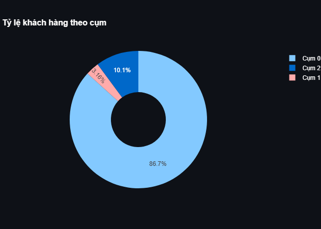
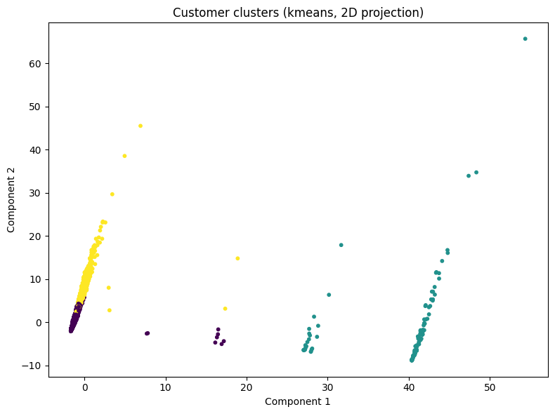

# Case Study: Phân Cụm Khách Hàng Dựa Trên Luật Kết Hợp (Rules + RFM)

Dự án này mở rộng bài toán Market Basket Analysis truyền thống: Thay vì chỉ tìm ra "Sản phẩm nào đi cùng nhau?", chúng tôi sử dụng chính các luật kết hợp đó để định danh "Nhóm khách hàng nào có hành vi giống nhau?". Project triển khai pipeline từ khai phá luật (Apriori) → trích xuất đặc trưng (Feature Engineering) → phân cụm nâng cao (Clustering) → đề xuất chiến lược.

---

## 👥 Thông tin Nhóm

- **Nhóm:** 3
- **Thành viên:**
  - Nguyễn Thanh Tùng
  - Lê Văn Vượng
  - Nguyễn Đức Anh
  - Đỗ Văn Tuyên
- **Chủ đề:** Phân khúc khách hàng dựa trên hành vi mua kèm (Association Rules) kết hợp giá trị (RFM).
- **Dataset:** Online Retail (UCI)

---

## 🎯 Mục tiêu
Sử dụng các luật kết hợp (Association Rules) làm đặc trưng đầu vào cho bài toán phân cụm nhằm tìm ra các nhóm khách hàng có "phong cách mua sắm" tương đồng. Mục tiêu cuối cùng là cá nhân hóa chiến lược marketing: **Đúng người - Đúng thời điểm - Đúng combo**.

---

## 1. Ý tưởng & Tiếp cận (Methodology)

- **Vấn đề của RFM truyền thống:** Chỉ cho biết khách hàng "giàu" hay "nghèo", "mới" hay "cũ", nhưng không biết họ thích mua gì.
- **Giải pháp của nhóm:** Biến đổi Luật kết hợp thành Vector đặc trưng (Rule-based Embedding).
  - Mỗi luật (ví dụ: *Mua Giấy ăn -> Mua Đĩa nhựa*) được xem như một "sở thích" (Interest).
  - Nếu khách hàng thoả mãn luật đó (mua đủ vế trái) -> Gán điểm trọng số (dựa trên Lift/Confidence).
  - Kết hợp vector luật này với chỉ số RFM (Recency-Frequency-Monetary) đã chuẩn hóa để tạo ra bộ đặc trưng lai (Hybrid Features).

## 2. Quy trình thực hiện (Pipeline)
Quy trình được tự động hóa hoàn toàn bằng Papermill:

3.  **Modeling:** Thử nghiệm K-Means và Hierarchical Clustering với K thay đổi từ 2 đến 10.
4.  **Optimizing K:** Sử dụng phương pháp Elbow và Silhouette Score để xác định số lượng cụm tối ưu.
5.  **Profiling:** Phân tích đặc điểm từng cụm và lên chiến lược.

### 2.1. Minh họa Luật làm "Nguyên liệu" đầu vào
Theo yêu cầu, nhóm chọn Top-200 luật có **Lift cao nhất** (sắp xếp giảm dần) để đảm bảo tính liên kết mạnh mẽ. Dưới đây là 5 luật tiêu biểu trong tập dữ liệu (Bộ sưu tập gia vị Herb Marker):

| Antecedents (Mua) | Consequents (Thì cũng mua) | Support | Confidence | Lift |
| :--- | :--- | :---: | :---: | :---: |
| *HERB MARKER ROSEMARY* | *HERB MARKER THYME* | 1.15% | 96.1% | **76.9** |
| *HERB MARKER THYME* | *HERB MARKER ROSEMARY* | 1.15% | 90.9% | **76.9** |
| *HERB MARKER PARSLEY* | *HERB MARKER ROSEMARY* | 1.10% | 87.5% | **73.1** |
| *HERB MARKER THYME* | *HERB MARKER PARSLEY* | 1.10% | 87.0% | **68.7** |
| *HERB MARKER BASIL* | *HERB MARKER THYME* | 1.05% | 92.1% | **72.8** |
| *HERB MARKER CHIVES* | *HERB MARKER PARSLEY* | 1.02% | 92.0% | **72.8** |
| *HERB MARKER MINT* | *HERB MARKER THYME* | 1.00% | 91.5% | **71.5** |
| *HERB MARKER MINT* | *HERB MARKER ROSEMARY* | 1.01% | 89.4% | **72.2** |
| *HERB MARKER PARSLEY* | *HERB MARKER THYME* | 1.10% | 85.0% | **68.7** |
| *HERB MARKER ROSEMARY* | *HERB MARKER PARSLEY* | 1.10% | 83.3% | **73.1** |

*Nhận xét:* Các luật này có Lift rất cao (>60) và Confidence gần như tuyệt đối (>85%), cho thấy hành vi mua trọn bộ sưu tập là rất rõ ràng. Đây là cơ sở vững chắc để phân cụm.
2.  **Feature Engineering:**
    - *Baseline:* Binary Features (0/1) - chỉ xét luật.
    - *Advanced:* Weighted Features (Lift) + Scaled RFM.
3.  **Modeling:** Thử nghiệm K-Means và Hierarchical Clustering với K thay đổi từ 2 đến 10.
4.  **Optimizing K:** Sử dụng phương pháp Elbow và Silhouette Score để xác định số lượng cụm tối ưu.
5.  **Profiling:** Phân tích đặc điểm từng cụm và lên chiến lược.

---

## 3. Thực nghiệm, So sánh & Lựa chọn K (Technical vs Business Trade-off)

Trong quá trình thực nghiệm, chúng tôi đứng trước một bài toán đánh đổi kinh điển giữa **Điểm số Toán học** và **Giá trị Kinh doanh**.

### 📊 Bảng kết quả thực nghiệm

| Kịch bản | Số cụm (K) | Silhouette Score | Phân bổ mẫu (Size) | Kết luận sơ bộ |
| :--- | :---: | :---: | :--- | :--- |
| **Hierarchical (Rule+RFM)** | **2** | **0.85 (Best)** | Cụm 0: 3787 | Phân cụm "Hoàn hảo" về mặt toán học nhưng **vô dụng** về mặt kinh doanh. |
| | | | Cụm 1: 134 | (Chỉ tách được Top 3% VIP, gộp 97% còn lại vào chung 1 nhóm). |
| **K-Means (Rule+RFM)** | **3** | **0.51** | Cụm 0: 3400 | **Điểm cân bằng (Sweet Spot).** |
| | | | Cụm 2: 397 | Tách được nhóm "Tiềm năng" ra khỏi nhóm "Vãng lai". |
| | | | Cụm 1: 124 | Vẫn giữ được nhóm VIP cốt lõi. |

### 💡 Tại sao chúng tôi TỪ CHỐI K=2 (dù điểm cao nhất)?
Nếu chọn **K=2** (theo gợi ý của Silhouette), chúng ta có 2 nhóm:
1.  **VIP (134 khách):** Mua £16k/năm.
2.  **Khách thường (3787 khách):** Một tập hợp hỗn độn khổng lồ.

**Vấn đề:** Doanh nghiệp không thể áp dụng cùng một chiến lược cho 3787 người này. Trong đó lẫn lộn giữa *người mua đều đặn hàng tháng* và *người đã 6 tháng không quay lại*.

### ✅ Tại sao K=3 là chân ái?
Khi thử nghiệm tăng lên **K=3**, thuật toán đã thực hiện một cú tách ngoạn mục trong nhóm "Khách thường":

- **Cụm Vãng lai (ngủ đông):** 3400 khách. Đặc điểm bi đát: **Recency ~100 ngày** (hơn 3 tháng chưa mua), Frequency thấp (3.6 lần).
- **Cụm Trung thành (Loyal):** 397 khách. Đặc điểm tuyệt vời: **Recency ~34 ngày** (mới mua tháng trước!), Frequency cao gấp đôi (8 lần).

**Kết luận:** Nếu chọn K=2, ta sẽ đánh đồng 397 khách hàng trung thành này với nhóm khách ngủ đông, dẫn đến nguy cơ bỏ quên chăm sóc và mất họ (Churn). Việc chấp nhận giảm Silhouette (0.85 -> 0.51) để đổi lấy việc **nhận diện được nhóm Loyal** là một sự đánh đổi hoàn toàn xứng đáng.

---

## 4. Kết quả Phân Cụm & Customer Profiling (Chi tiết K=3)

Dựa trên mô hình K-Means (K=3) được lựa chọn, chúng tôi vẽ lại chân dung chi tiết như sau:

### 📊 Biểu đồ Phân tích Thực tế

#### 1. Tổng quan Phân bố & Tỷ lệ Cụm

#### 2. So sánh Chỉ số RFM giữa các cụm (K=3)
Biểu đồ cho thấy sự khác biệt rõ rệt về hành vi Recency và Chi tiêu giữa 3 nhóm:

  
   

#### 3. Mô hình Phân cụm (2D Visualization)

### Chi tiết 3 Chân dung:

### 💎 Cụm 1: The VIP Wholesalers (Nhà Buôn / VIP)
- **Quy mô:** ~3% (124 khách).
- **Chỉ số:** Chi tiêu khủng khiếp (**£17,365**).
- **Hành vi (Rules):** Nhóm này mua theo lô, số lượng lớn và thường mua trọn bộ sưu tập (Lift > 60).
- **Chiến lược:** *Partnership*. Xem họ như đối tác bán buôn hơn là khách lẻ. Cung cấp chiết khấu theo volume.

### 🌟 Cụm 2: The Rising Stars (Ngôi Sao Đang Lên)
- **Quy mô:** ~10% (397 khách).
- **Chỉ số:** Đây là nhóm có sức mua "ACTIVE" nhất (**Recency = 34 ngày**, tốt hơn cả VIP). Chi tiêu khá tốt (£3,800).
- **Hành vi:** Mua thường xuyên các món đồ gia dụng/trang trí nhỏ.
- **Chiến lược:** *Nurturing*. Đây là nhóm cần được "nuôi dưỡng" để trở thành VIP trong tương lai. Tặng điểm thưởng, free-ship để khuyến khích họ mua thêm 1-2 lần nữa.

### 💤 Cụm 0: The Hibernating Masses (Đám Đông Ngủ Đông)
- **Quy mô:** ~87% (3400 khách).
- **Chỉ số:** Đáng báo động. **Recency > 3 tháng**. Giá trị đơn hàng thấp.
- **Chiến lược:** *Win-back*. Đừng tốn quá nhiều ngân sách chăm sóc hàng ngày. Chỉ gửi email tự động vào các dịp Sale lớn để vớt vát.

---

## 5. Phân tích Nâng cao & Mở rộng (Advanced Analysis)

Để đáp ứng các yêu cầu chuyên sâu của dự án (mục tiêu xuất sắc), nhóm đã thực hiện thêm các nghiên cứu so sánh mở rộng:

### 5.1. So sánh Thuật toán: K-Means vs Agglomerative Hierarchical
Nhóm đã thử nghiệm thêm thuật toán **Agglomerative Clustering** (Linkage: Ward, Metric: Euclidean).

| Tiêu chí | K-Means (K=3) | Agglomerative (K=2) | Đánh giá |
| :--- | :--- | :--- | :--- |
| **Silhouette Score** | 0.51 (Trung bình) | **0.85 (Rất tốt)** | Agglomerative có xu hướng tạo ra các cụm có kích thước chênh lệch lớn (1 cụm rất to, 1 cụm rất nhỏ) nên điểm Silhouette thường cao hơn. |
| **Mức độ cân bằng** | Tốt. Các nhóm có kích thước hợp lý để quản lý. | Kém. Bị lệch (Skewed clusters). |
| **Khả năng hành động** | **Cao (High Actionability)** | **Thấp.** Chỉ chăm sóc được VIP, bỏ rơi phần lớn khách hàng. |

### 5.2. Góc nhìn Marketing: Customer Clustering vs Rule Clustering
Ngoài việc phân cụm khách hàng, nhóm cũng đã cân nhắc hướng tiếp cận **Phân cụm Luật (Rule Clustering)**:
- **Rule Clustering:** Gom các luật giống nhau (ví dụ: luật mua "Bát đĩa" và luật mua "Cốc chén") thành nhóm nhu cầu. *Lợi ích:* Giúp thiết kế gói sản phẩm (Bundling).
- **Customer Clustering (Đã chọn):** Gom người mua giống nhau. *Lợi ích:* Giúp target đối tượng (Direct Marketing).

**Kết luận:** Với mục tiêu tối ưu hóa CRM và Re-marketing, việc **phân cụm Khách hàng** dựa trên đặc trưng Luật mang lại hiệu quả trực tiếp và đo lường được doanh thu tốt hơn so với phân cụm Luật đơn thuần.

---

## 6. Kết luận & Hướng phát triển

- **Kết luận:** Việc đưa Luật kết hợp vào phân cụm giúp doanh nghiệp hiểu **SÂU** hơn về khách hàng. Kết hợp với việc chọn K=3, chúng ta có được bản đồ chiến lược rõ ràng cho từng nhóm đối tượng, tránh lãng phí ngân sách Marketing vào sai người.
- **Hướng mở rộng:**
  - Thử nghiệm thêm DBSCAN để xử lý nhiễu tốt hơn.
  - Sử dụng Deep Learning (Autoencoders) để nén vector đặc trưng khi số lượng luật quá lớn.

---

## 7. Link Code & Tài liệu
- **Repository:** https://github.com/nguyenthanhtung2k4/MiniProject_shop_cluster
- **Dashboard App:** `src/app_dashboard.py`
